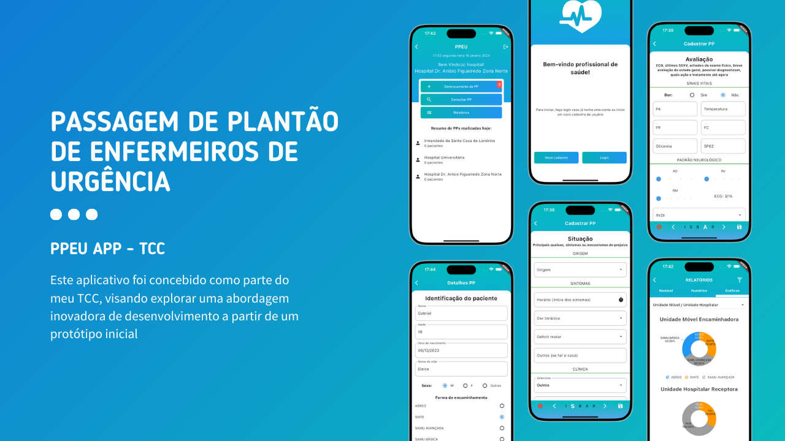

# PPEU - Passagem de plantão de enfermeiros de urgência 

  
  

Este aplicativo foi desenvolvido em meu TCC como um caso de uso aplicado. * *link do artigo em breve* *

## O que é a passagem de plantão de enfermeiros de urgência
Passagens de plantão de enfermeiros de urgência são breves trocas de informações críticas entre enfermeiros que ocorrem durante mudanças de turno em unidades de atendimento de emergência. Durante essa passagem, detalhes sobre pacientes em estado crítico, tratamentos urgentes, medicamentos administrados e quaisquer mudanças súbitas na condição dos pacientes são comunicados para garantir uma transição suave e segura entre os turnos, assegurando a continuidade do cuidado urgente.

## Quais as funcionalidades deste aplicativo
Primeiramente precisamos contextualizar os níveis de usuários no aplicativo dependedo do cadastro e login:
1. **Unidade Móvel:** Responsável por criar a passagem de plantão quando um paciente é encaminhado para a unidade hospitalar. Eles compartilham informações detalhadas sobre o estado do paciente, tratamentos realizados, medicamentos administrados e quaisquer outras informações relevantes para garantir a continuidade do cuidado.
2. **Unidade Hospitalar:** Responsável por receber a passagem de plantão quando chegam à unidade hospitalar. Eles recebem informações críticas sobre os pacientes que estão sendo transferidos para cuidados hospitalares.

Dentre os fluxos do aplicativo podemos citar:
1. **Login:** O login é responsável por ditar qual nível de usuário esta acessando sendo ele uma unidade móvel ou unidade hospitalar.
2. **Cadastro:** O cadastro parte das informações do enfermeiro e quais unidades ele atua.
3. **Criar passagem de plantão:** Neste fluxo o cadastro da passagem de plantão acontece por parte da unidade móvel e seus formulários são separados por um contexto chamado ISBAR (identificação, situação, breve histórico, avaliação e recomendação ).
4. **Receber passagem de plantão:** A unidade hospitalar por sua vez tem a responsabilidade de analisar a passagem de plantão e receber a mesma.
5. **Consultar passagem de plantão:** Podemos consultar as passagens de plantão por unidade hopitalar, unidade móvel, responsável, nome do paciente um periodo de tempo.
6. **Consultar relatórios da unidade móvel/hospitalar:** Podemos consultar todos os relatórios da unidade sendo hospitalar/móvel por sua vez de forma nominal, númerica ou gráfica

## Resultado avaliação do software
Optei por utilizar duas metodologias sendo System Usability Scale (SUS) e Technology Acceptance Model (TAM) que resultou em:

**System Usability Scale (0-100):** 83,75 pontos.

**Technology Acceptance Model** por sua vez é separado em 4 formulários que resulta em médias de 1 à 5, sendo 1 para ruim e 5 para excelente
  - Facilidade de uso percebida: 4,5
  - Utilidade percebida: 4,2
  - Atitude em relação ao uso: 4,4
  - Intenção de uso: 4,5

Você pode encontrar mais informações referente a avaliação no artigo desenvolvido.

## Autores
| [ Gabriel Lima](https://github.com/Gabriellimmaa) |
| :---: 
